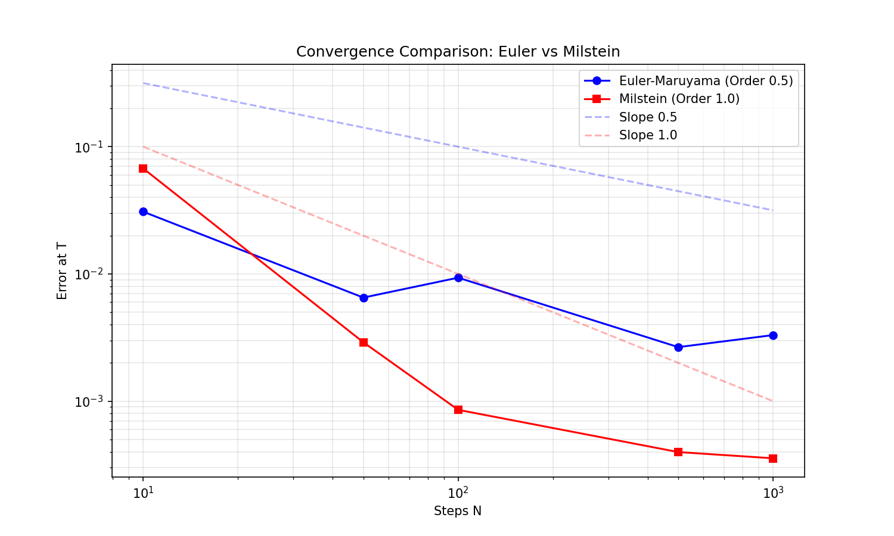

# SDE Solver Project

This is my implementation of numerical methods for Stochastic Differential Equations (SDEs).
I implemented both **Euler-Maruyama** and **Milstein** schemes to compare their convergence rates.

## Mathematical Background

The goal was to solve Itô SDEs:

```math
dX_t = a(X_t, t)dt + b(X_t, t)dW_t
```

Where:
- a(X, t): Drift
- b(X, t): Diffusion
- W_t: Brownian motion

### Methods Implemented

**1. Euler-Maruyama**
Standard method (Order 0.5). Simple to implement but converges slowly.
```math
X_{n+1} = X_n + a(X_n)\Delta t + b(X_n)\Delta W_n
```

**2. Milstein Scheme**
I added this one to get better precision (Order 1.0). It uses the derivative of the diffusion term.
```math
X_{n+1} = X_n + a(X_n)\Delta t + b(X_n)\Delta W_n + \frac{1}{2}b(X_n)b'(X_n)((\Delta W_n)^2 - \Delta t)
```

## Results

I compared both methods on a Geometric Brownian Motion.
As expected, Milstein is much better when we reduce the step size (slope is steeper in the log-log plot).



### Examples

I also tested the solver on:
1. **Black-Scholes Model** (Stock prices)
2. **Ornstein-Uhlenbeck** (Interest rates)

## How to run

I used `uv` for dependency management because it's faster, but standard pip works too.

```bash
# Install dependencies
uv sync  # or 'pip install .'

# Run everything
uv run run_all.py # or 'python run_all.py'
```

## Difficulties Encountered

- Getting the Milstein scheme to work was tricky because of the derivative term.
- I had some issues with the random seed for the convergence test (needed to reset it for fair comparison).


## Future Improvements

- [ ] Add Runge-Kutta stochastic schemes (Higher Order).
- [ ] Optimize the loops with Numba (currently pure NumPy).
- [ ] Implement Jump-Diffusion processes (Merton Model).


